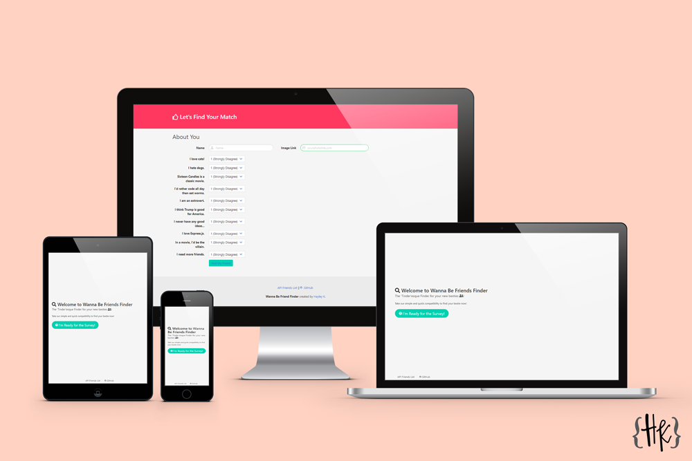

# Wanna Be Friends App

For this this activity, I was asked to build a compatibility-based "FriendFinder" application -- kind of like a Tinder for friends. It will let the user submit a form of 10 questions and let them know who in the database is their best match up to. This full-stack site takes in results of the users' surveys, then compares their answers with those from other users. The app will then display the name and picture of the user with the best overall match.

I used Express to handle routing. Check out the app running on heroku here: https://obscure-wildwood-65057.herokuapp.com/

## Installation Instructions

1. Take a fork or clone of this repo: `git clone git@github.com:CopperCo/WannaBeFriends.git`
2. Using your CLI or terminal `cd WannaBeFriends` into the folder and run `npm install` this will install the npm dependencies from the package.json file.
3. Then run `node server .js`, the console will log the port for the server to view on your browser.
4. Open http://localhost:PORT/ on your default browser.

## Tools Used

- Heroku
- Bulma CSS Framework
- NodeJS
- Node Packages
  - body-parser
  - express
  - path

## Support

If you find an error or bug please [let me know.](https://github.com/CopperCo/WannaBeFriends/issues)
